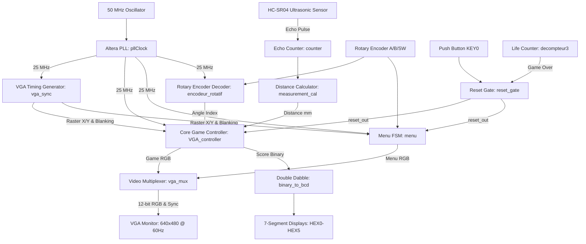

# Fruit Ninja on FPGA (Intel DE10-Lite)

-0071C5?style=for-the-badge&logo=intel&logoColor=white)


A complete, fully hardware-accelerated **Fruit Ninja** arcade game implemented in pure register-transfer level (RTL) VHDL on an **Intel MAX 10 FPGA**. 

Unlike conventional embedded systems that rely on a softcore microcontroller (such as Nios II or MicroBlaze), this entire system—including physics simulation, trigonometric line slicing, ultrasonic contactless gesture tracking, graphical menu FSM, ROM sprite pipelines, and 640x480 @ 60 Hz VGA generation—runs on **dedicated synchronous hardware pipelines** operating at 25 MHz and 50 MHz clock domains.

---

## Key Features

- **Pure Digital RTL Implementation**: Zero CPU overhead; 100% synthesized digital logic, DSP multipliers, and embedded block RAMs (M9K).
- **Contactless Blade Height Tracking**: Interfaces with an HC-SR04 ultrasonic distance sensor to position the blade vertically in real time based on hand height, filtered by an IIR low-pass filter to reject jitter.
- **Rotary Angular Slicing**: KY-040 rotary encoder decodes hand angle from $-55^\circ$ to $+55^\circ$ using an integrated 2 ms digital debouncing filter and a symmetric fixed-point tangent lookup table.
- **Physical Slicing Trigger**: 25 MHz edge-latching strike button guarantees that high-speed slice inputs are never dropped between frames.
- **Parabolic Projectile Physics**: Hardware simulation of gravity ($v_y - t/7$), velocity vectors, and wall boundary bounces for up to 13 concurrent fruit and bomb sprites.
- **Pomegranate Multi-Slice Mechanics**: Spawns a special pomegranate bonus fruit every 20 slices that freezes projectile motion and requires 20 rapid strikes to detonate for massive combo points.
- **Interactive Graphical Menu**: Full-featured menu FSM supporting title splash screen, mode selection (**Classic**, **Zen**, **Arcade**), and speed presets (**Slow**, **Medium**, **Fast**), navigable via rotary encoder or onboard switches.
- **VGA Video Generation (640x480 @ 60 Hz)**: 12-bit RGB color output via resistor DAC, featuring an ultra-sharp single-pixel raster blade line and on-the-fly sprite address generation.
- **Double Dabble BCD & 7-Segment Displays**: Real-time score, remaining lives, and countdown timers displayed across 6 onboard 7-segment hex displays.
- **Robust System Reset & Game Over Recovery**: Synchronous active-low reset gate combining the physical `KEY0` push-button and automatic Game Over detection, seamlessly returning the user to the main menu.

---

## Hardware Architecture

The system is organized into modular hardware blocks clocked synchronously:



---

## Hardware Pinout (Intel DE10-Lite)

All physical pin assignments are pre-configured in `VGA_GAme2.qsf`:

| Peripheral | Signal Name | FPGA Pin | I/O Standard | Description |
|---|---|---|---|---|
| **System Clock** | `Clk` | `PIN_P11` | 3.3V | 50 MHz Onboard Crystal Oscillator |
| **System Reset** | `KEY0` | `PIN_B8` | 3.3V | Active-low push-button (Global Reset) |
| **Strike Button** | `boutton` | `PIN_A7` | 3.3V | Active-low push-button (Blade Strike Trigger) |
| **VGA Video** | `HSYNC` | `PIN_N3` | 3.3V | Horizontal Synchronization |
| | `VSYNC` | `PIN_N1` | 3.3V | Vertical Synchronization |
| | `r[3..0]` | `PIN_Y1, PIN_Y2, PIN_V1, PIN_AA1` | 3.3V | Red Channel (4-bit Resistor DAC) |
| | `g[3..0]` | `PIN_R1, PIN_R2, PIN_T2, PIN_W1` | 3.3V | Green Channel (4-bit Resistor DAC) |
| | `b[3..0]` | `PIN_N2, PIN_P4, PIN_T1, PIN_P1` | 3.3V | Blue Channel (4-bit Resistor DAC) |
| **HC-SR04 Sensor** | `i_trigger` | `PIN_V10` | 3.3V | Ultrasonic Trigger Pulse Output |
| | `i_Ech` | `PIN_W10` | 3.3V | Ultrasonic Echo Return Input |
| **Rotary Encoder**| `encoder_A` | `PIN_AB5` | 3.3V (Weak Pull-up) | Quadrature Channel A |
| | `encoder_B` | `PIN_AB6` | 3.3V (Weak Pull-up) | Quadrature Channel B |
| | `encoder_SW`| `PIN_AB7` | 3.3V (Weak Pull-up) | Push-Button Switch (Active-low) |
| **7-Segment Displays** | `seg1..seg14` | `PIN_C14 .. PIN_B17` | 3.3V | Score Display (Units, Tens, Hundreds) |
| | `o_Sev_Seg_1..3` | `PIN_F21 .. PIN_N20` | 3.3V | Timer / Lives Display |

---

## Game Modes & Controls

### Game Modes
1. **Classic Mode**:
   - 3 lives shown on the 7-segment display.
   - Missing a fruit decrements 1 life ($3 \rightarrow 2 \rightarrow 1 \rightarrow 0$).
   - Slicing a bomb instantly causes life loss.
   - Game Over triggers at 0 lives, freezing the board and returning directly to the main menu.
2. **Zen Mode**:
   - 90-second countdown timer.
   - Bombs are disabled; pure fruit-slicing focus to achieve the highest possible score.
3. **Arcade Mode**:
   - 60-second countdown timer.
   - Bombs incur a $-10$ points score penalty without losing lives.
   - Simultaneous multi-fruit cuts grant combo bonus multipliers ($+2\times$, $+10$ points).

### Controls
| Action | Input Device | Behavior |
|---|---|---|
| **Navigate Menu** | Rotary Encoder (Turn) | Rotate clockwise/counter-clockwise to cycle through options. |
| **Select / Confirm** | Rotary Encoder (Push) | Press shaft down to validate selection or launch game. |
| **Blade Angle** | Rotary Encoder (Turn in Game) | Dynamically tilts the cutting line from $-55^\circ$ to $+55^\circ$ (horizontal at index 9). |
| **Blade Height** | HC-SR04 Ultrasonic Sensor | Move hand closer/farther ($20\text{ mm} \dots 400\text{ mm}$) to glide the blade up/down. |
| **Slice / Cut** | Push-button (`PIN_A7`) | Press to strike along the active blade line. |
| **Emergency Reset** | Push-button (`KEY0`) | Immediately resets score and game state, returning to the menu. |

---

## Mathematical & Algorithmic Highlights

### 1. Fixed-Point Tangent Table Line Equation
To achieve real-time angular slicing without floating-point units or divider IP blocks, blade slope calculations use scaled integer arithmetic:
$$y_{\text{blade}}(x) = \text{height}_{\text{cut}} - \frac{\text{tan\_table}(\theta) \cdot x}{1024}$$
Where $\text{tan\_table}(\theta) = \lfloor 1024 \cdot \tan(\theta) \rfloor$ stored in a symmetric 19-entry lookup table.

### 2. Line-Box Intersection in Hardware
For every active sprite with bounding box $[x_i, x_i + W] \times [y_i, y_i + H]$:
1. Compute blade intercept at left edge: $y_{\text{left}} = y_{\text{blade}}(x_i)$
2. Compute blade intercept at right edge: $y_{\text{right}} = y_{\text{blade}}(x_i + W)$
3. Define range: $y_{\text{min}} = \min(y_{\text{left}}, y_{\text{right}})$, $y_{\text{max}} = \max(y_{\text{left}}, y_{\text{right}})$
4. Detect collision:
   $$\text{Intersect} = (y_{\text{min}} \le y_i + H) \land (y_{\text{max}} \ge y_i) \land (y_i \in [0, 480])$$
5. A slice is confirmed if $\text{Intersect} = \text{TRUE}$ and the strike button was pressed during the frame.

### 3. Ultrasonic Echo Reciprocal Scaling
The HC-SR04 pulse duration in nanoseconds is converted to millimeters via a 30-bit fixed-point reciprocal multiplier:
$$\text{factor} = \frac{2^{42}}{1000 \cdot 5.8} \approx 758283881$$
$$\text{Distance (mm)} = \frac{(\text{cycles} \cdot 20\text{ ns}) \cdot 758283881}{2^{42}}$$

---

## Directory Structure

```
.
├── VGA_controller.vhd         # Core game physics, collision ALU, scoring, and VGA renderer
├── menu.vhd                   # Interactive menu state machine, navigation & UI renderer
├── encodeur_rotatif.vhd       # Rotary encoder digital debounce & quadrature decoder
├── reset_gate.vhd             # System reset combining logic (KEY0 + Game Over)
├── decompteur3.vhd            # 3-life counter with Game Over pulse latch
├── decompteur9.vhd            # BCD countdown timer (units)
├── decompteur10.vhd           # BCD countdown timer (tens)
├── vga_sync.vhd               # 640x480 @ 60 Hz VGA raster timing generator
├── vga_mux.vhd                # 12-bit RGB multiplexer (menu vs. game scene)
├── measurement_cal.vhd        # Fixed-point ultrasonic distance calculator
├── counter.vhd                # Ultrasonic echo pulse width counter
├── SBPA.vhd                   # 8-bit Galois LFSR pseudo-random number generator
├── output_files/
│   ├── binary_to_bcd.vhd      # Double Dabble binary-to-BCD score converter
│   ├── counter_mux.vhd        # 7-segment display routing multiplexer
│   ├── seven_seg_dispayer.vhd # Active-low 7-segment segment pattern decoder
│   └── VGA_GAme2.sof          # Compiled FPGA bitstream ready to flash
├── VGA_GAme2.bdf              # Top-level schematic diagram
├── VGA_GAme2.qsf              # Quartus project settings & pin assignments
└── README.md                  # Project documentation
```

---

## Build & Programming Instructions

### Prerequisites
- **Intel Quartus Prime Lite Edition** (v20.1 or compatible)
- **USB-Blaster Driver** installed (included with Quartus)
- **Terasic DE10-Lite FPGA Board**

### Command-Line Compilation
From PowerShell or terminal in the project directory:
```powershell
# 1. Analysis and Synthesis
quartus_map VGA_GAme2

# 2. Place & Route (Fitter)
quartus_fit VGA_GAme2

# 3. Bitstream Generation
quartus_asm VGA_GAme2
```

### Flashing the FPGA
1. Connect the DE10-Lite board via USB cable to your PC.
2. Launch **Quartus Prime Programmer**:
   ```powershell
   quartus_pgm -m jtag -c "USB-Blaster [USB-0]" -o "p;output_files/VGA_GAme2.sof"
   ```
3. Connect your VGA monitor to the board's VGA port and enjoy the game!

## Repository Structure

```
fruit-ninja-fpga/
├── src/                # Pure RTL VHDL sources (VGA controller, FSM, encoder, counters)
├── mif/                # 27 Memory Initialization Files (sprites, fruit bitmaps, menus)
├── schematics/         # Quartus Block Designs (.bdf) & Symbol files (.bsf)
├── ip/                 # Generated MegaWizard IP blocks (PLL clock, ROM wrappers, .qip, .cmp)
├── VGA_GAme2.qpf       # Quartus Prime project file
├── VGA_GAme2.qsf       # Pin assignments & device configuration
├── README.md           # Technical documentation and hardware guide
└── .gitignore
```

---

## License & Attribution

Designed and engineered for FPGA hardware digital design coursework and portfolio presentation.
- Target Board: **Terasic DE10-Lite (Intel MAX 10 10M50DAF484C7G)**
- Architecture: **Pure synchronous RTL VHDL-2008**
